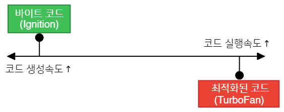
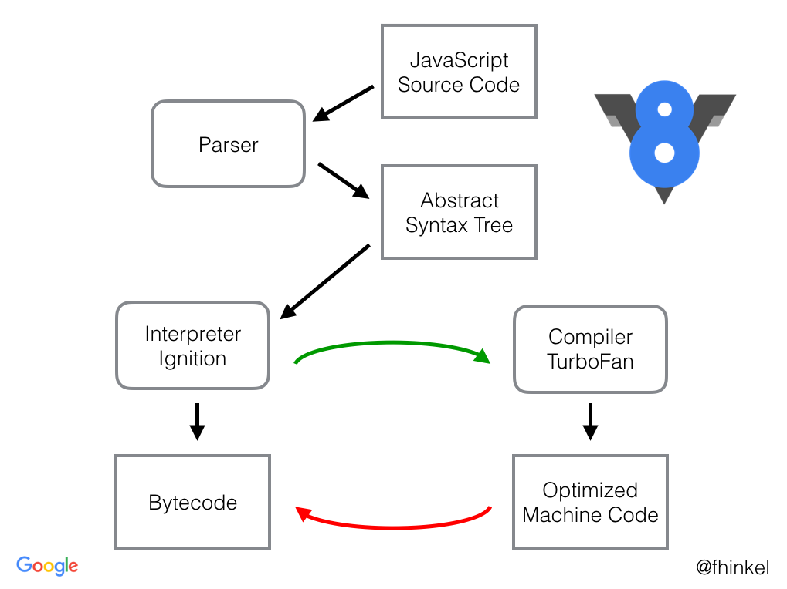
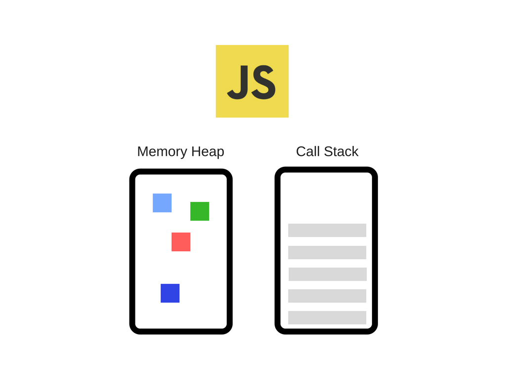
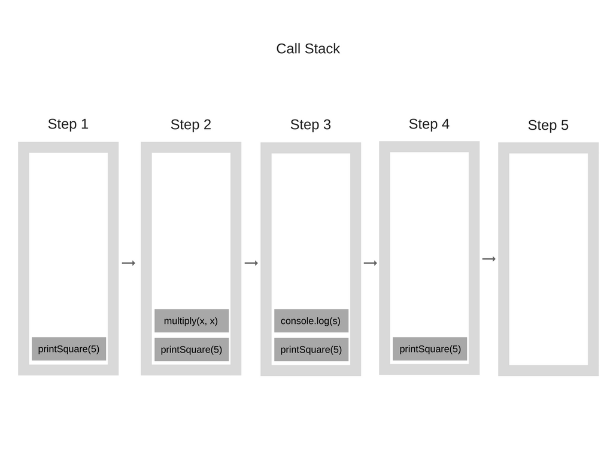
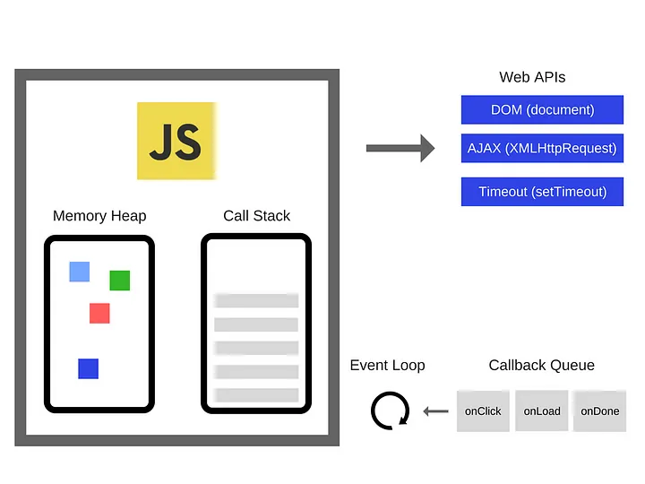

## 코드의 번역


https://spartacodingclub.kr/blog/how-javascript-works-1

언어에 상관없이, 작성된 코드는 기계가 이해할 수 있도록 번역되고, 번역 결과물은 실행된다.

이 때, 번역의 방식은 크게 두가지로 구분한다!

## **Compilation vs Interpretation**

](~@source/../../assets/img/post1/post1img2.png/)

[https://ctkim.tistory.com/entry/컴파일러compiler와-인터프리터interpreter의-차이](https://ctkim.tistory.com/entry/%EC%BB%B4%ED%8C%8C%EC%9D%BC%EB%9F%ACcompiler%EC%99%80-%EC%9D%B8%ED%84%B0%ED%94%84%EB%A6%AC%ED%84%B0interpreter%EC%9D%98-%EC%B0%A8%EC%9D%B4)

### 1. 컴파일러(Compiler)

- 기계어 코드를 생성하는 데 시간이 걸리지만 효율적

### 2. 인터프리터(Interpreter)

- 빠르게 바이트 코드를 생성할 수 있지만 그다지 효율적이지 못함



https://jaehyeon48.github.io/javascript/google-v8-engine/

## JavaScript Engine: JavaScript를 번역하여 실행하는 프로그램


https://www.jeong-min.com/49-js-runtime/

브라우저마다 사용하는 엔진이 다르고, 각 엔진마다 코드를 해석하고 실행하는 내부 로직이 다르기 때문에, 같은 JS 코드를 작성해도 성능 차이가 발생할 수 있다.



https://v8.dev/docs

### V8 - 구글에서 개발한 오픈 소스 자바스크립트 엔진( 크롬과 Node.js에서 사용 )

### V8 엔진의 동작

1. 자바스크립트 코드를 Parser로 넘긴다.
2. Parser는 추상 구문 트리(AST)를 생성
3. AST를 기반으로 Ignition이 바이트 코드를 생성
4. 바이트코드를 실행함으로써 실제 자바스크립트 실행

+@ 자주 사용되는 코드는 TurboFan으로 컴파일하여 최적화된 기계어로 실행

# 자바스크립트의 동작



- 메모리 힙 - 변수나 함수를 선언, 저장, 호출하는 공간
- 콜 스택 - 작업 순서를 쌓아두고 하나씩 수행하는 공간 (싱글 스레드)

### Call Stack 예제)

```jsx
function multiply(x, y) {
    return x * y;
}
function printSquare(x) {
    var s = multiply(x, x);
    console.log(s);
}
printSquare(5);
```



### 싱글 스레드 기반으로 작동하기 때문에..

- 하나의 작업이 끝나야 다음 작업을 수행 가능하다.
- 오래걸리는 작업이 많아 질 수록 성능에 영향이 크게 간다.


### 자바스크립트의 런타임 모델



https://medium.com/sessionstack-blog/how-does-javascript-actually-work-part-1-b0bacc073cf

1. Call Stack에서 비동기 함수가 실행되면, Web API에게 작업을 위임한다.
2. Web API가 작업을 수행한 뒤, CallBack함수를 Event Loop를 통해 CallBack Queue로 전달
3. Call Stack이 비어있을 때, CallBack Queue의 CallBack 함수를 콜 스택으로 전달.
4. Call Stack에서 CallBack 함수를 실행하고 제거.

⇒ 싱글스레드 언어임에도 멀티스레드 환경에서 동작하기 때문에 
여러 가지 일을 동시에 처리하는 것 처럼 동작할 수 있다.